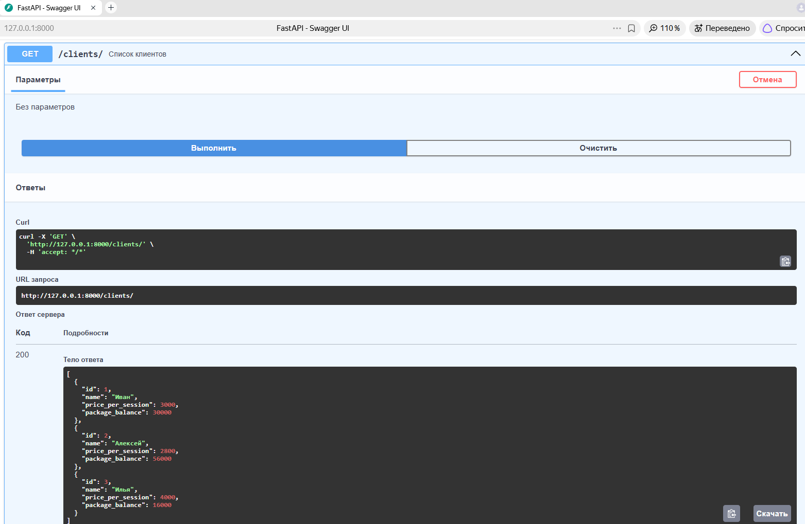
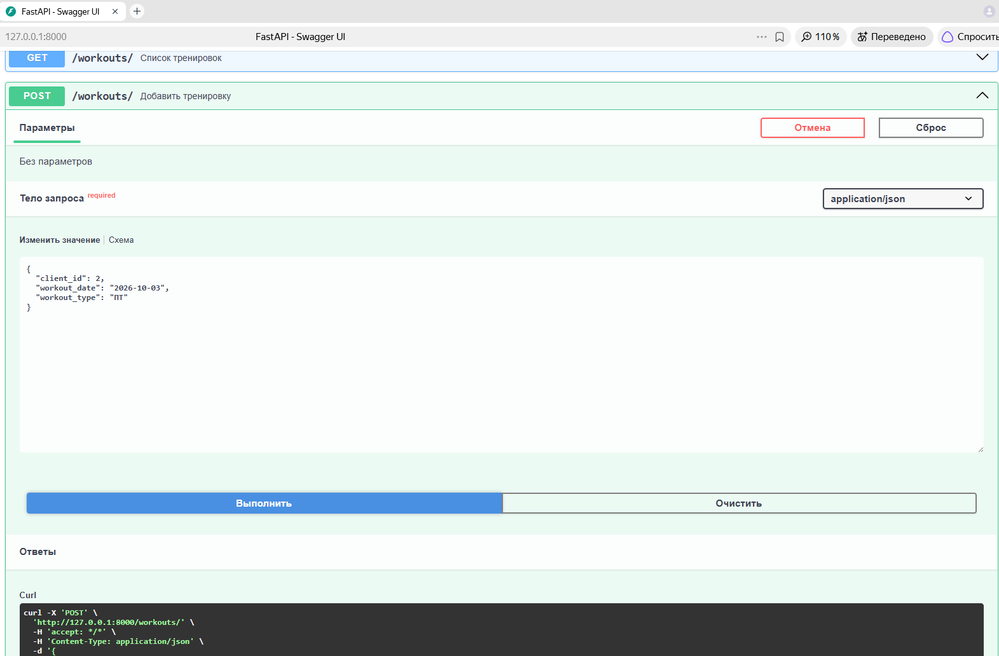
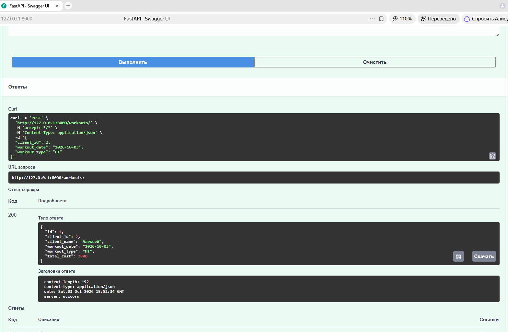

# Workout Counter

Workout counter – это приложение для тренера. Workout counter ведёт базу клиентов (имена, цены тренировок, остатки балансов на пакетах). Фактическая стоимость тренировки варьируется от её типа. Workout counter также сохраняет в базе данных информацию об уже проведённых тренировках.

## Что реализовано

- REST API для CRUD операций по тренировкам
- Работа с базой данных через SQLAlchemy (ORM)
- Структурированная модульная архитектура (app/crud, app/models, app/schemas)
- Управление зависимостями через `requirements.txt`
- Подготовка к деплою (`.gitignore`, базовая структура)

## Демонстрация работы API

Ниже представлен интерфейс Swagger UI, где автоматически сгенерирована документация для некоторых эндпоинтов проекта:





## Стек технологий

- Python 3.10+
- FastAPI
- Uvicorn (ASGI сервер)
- SQLAlchemy (ORM)
- SQLite (или любая другая СУБД через строку подключения)

## Как запустить локально

1. **Создай и активируй виртуальное окружение**
   ```cmd
   python -m venv t_env
   t_env\Scripts\activate

2. **Установи зависимости**
pip install -r requirements.txt

3. **Запусти сервер**
uvicorn app.main:app --reload

4. **Открой Swagger UI**

После запуска открой в браузере: http://127.0.0.1:8000/docs — здесь можно протестировать все эндпоинты без написания кода.


## Структура проекта
- app/main.py — точка входа, инициализация приложения
- app/database.py — настройка сессии и подключения к БД
- app/models.py — ORM-модели (таблицы)
- app/schemas.py — Pydantic-схемы для валидации запросов и ответов
- app/crud.py — логика создания/чтения/обновления/удаления
- requirements.txt — список зависимостей
- .gitignore — игнорируемые файлы (IDE, кэш, БД)

## Как использовать API
Примеры запросов доступны в Swagger UI (/docs). Основные сценарии:

- Создать тренировку: POST /workouts ВАЖНО: для создания тренировки в workout_types указать "ПТ" или "Сплит"
- Получить список тренировок: GET /workouts
- Получить тренировку по ID: GET /workouts/{id}
- Обновить тренировку: PUT /workouts/{id}
- Удалить тренировку: DELETE /workouts/{id}


## Что можно улучшить (планы развития)
- Добавить авторизацию (JWT)
- Подключить PostgreSQL вместо SQLite
- Написать автотесты (pytest)
- Добавить пагинацию и фильтрацию
- Обернуть в Docker-контейнер

## Автор
Дмитрий Каширин
